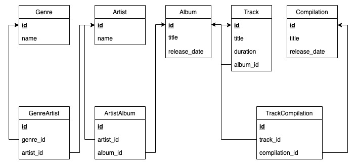

# Домашнее задание

### Обязательная часть

Измененная схема базы данных музыкального сервиса



```
CREATE TABLE Genre (
id serial primary key,
name varchar(40)
);

CREATE TABLE Artist (
id serial primary key,
name varchar(80)
);

CREATE TABLE Album (
id serial primary key,
title varchar(80),
release_date integer
);

CREATE TABLE Track (
id serial primary key,
title varchar(80),
duration integer,
album_id integer references album(id)
);

CREATE TABLE GenreArtist (
id serial primary key,
artist_id integer references artist(id),
genre_id integer references genre(id)
);

CREATE TABLE ArtistAlbum (
id serial primary key,
artist_id integer references artist(id),
album_id integer references album(id)
);

CREATE TABLE Compilation(
id serial primary key,
title varchar(80) not null, 
release_date integer not null
);

CREATE TABLE TrackCompilation (
id serial primary key,
track_id integer references track(id),
compilation_id integer references compilation(id)
);
```

###  Необязательная часть

Спроектировать отношение (или схему из нескольких отношений) "Сотрудник". У каждого сотрудника есть следующие параметры:

Имя
Отдел
Начальник (ссылка на начальника)
Примечание: начальник - тоже сотрудник. Отдел можно хранить строкой, можно идентификатором (не принципиально).

```
CREATE DATABASE company WITH OWNER netology; 

CREATE TABLE department (
id serial primary key,
department varchar(80) not null,
manager varchar(80) not null
);

CREATE TABLE employee (
id serial primary key,
name varchar(80) not null,
department_id integer not null references department(id)
);
```

